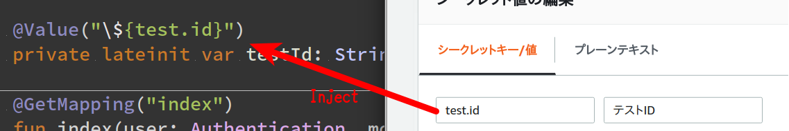

# spring-cloud-aws-secrets-manager
property values can be injected directly into your beans from aws secrets manager.

## How to use
### gradle
```
repositories {
  jcenter()
}

dependencies {
  compile 'com.github.siosio:spring-cloud-aws-secrets-manager:1.0.0'
}
```

### images


### disabling
please add the following to `resources/bootstrap.properties`.

```properties
aws.secretsmanager.enabled=false
```